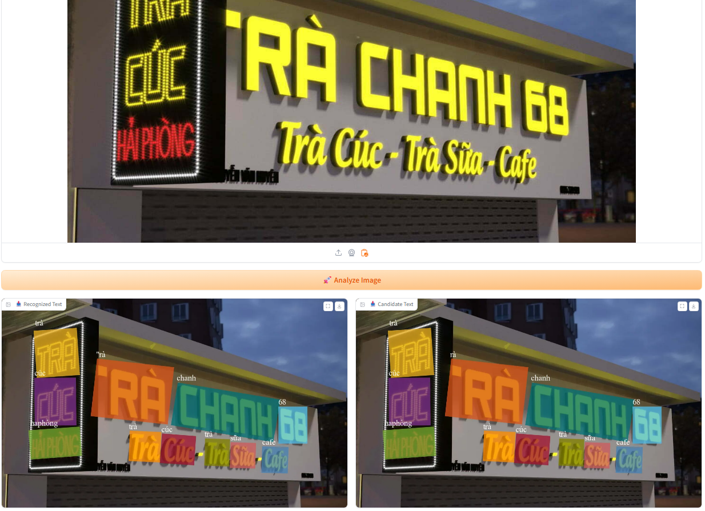

# Vietnamese Text Spotting with SwinTextSpotter

This repository implements Vietnamese text spotting using [SwinTextSpotter](https://github.com/mxin262/SwinTextSpotter) (CVPR 2022), enhanced with a dictionary-based correction mechanism. It supports Vietnamese text recognition with tone marks and provides an interactive Gradio interface for visualization.

## Features
- **Vietnamese Text Support**: Recognizes Vietnamese text with tone marks (e.g., `à`, `ệ`, `ũ`).
- **Dictionary-Based Correction**: Uses a Vietnamese dictionary to correct recognition errors (e.g., `nghuiền → `nghiền`).
- **Gradio Interface**: Allows users to upload images, visualize detection results, and compare recognized text with dictionary-corrected candidates.

## Installation
1. **Clone the Repository**:
```
git clone https://github.com/22520896/SwinTextSpotter-Custom.git
cd SwinTextSpotter-Custom
```
2. **Set Up Virtual Environment**:
```
conda create -n swints_env python=3.8 -y
conda activate swints_env
```
3. **Install Dependencies**:
```
conda install pytorch==1.8.1 torchvision==0.9.1 cudatoolkit=11.1 -c pytorch -c conda-forge
pip install gradio opencv-python scipy shapely rapidfuzz==2.13.7 Polygon3 dict_trie Levenshtein tensorboard fvcore pycocotools cloudpickle editdistance timm Pillow==9.5.0 antlr4-python3-runtime==4.9.3 gdown
python setup.py build develop
```
4. **Download the Model Pre-trained on the VinText dataset**:
```
mkdir -p output
gdown --id 1IfyPrYFnQOWoY8pPg-GIN5ofuALU15yD -O output/model_vintext.pth
```
5. **Run the Application**:
```python app.py```